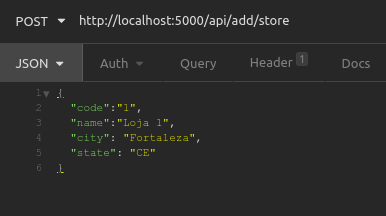

# API Flask, React, Mongo DB

CRUD utilizando Flask para API Backend, e algumas de suas ferramentas

- Flask
- flask_cors
- pymongo
- bson

## Como executar o projeto

Vamos executar os comandos abaixo partindo que esteja no diretório raiz onde fez o clone do projeto.

```sh
cd backend
export FLASK_APP=app
export FLASK_ENV=Development
export FLASK_DEBUG=True

flask run
```

Acesse o projeto através do endereço:
```sh
http://localhost:5000
```

## CRUD

###Create

Para criar uma entrada no banco iremos utilizar o path abaixo em algum aplicativo como Postman ou Insomnia

```sh
http://localhost:5000/api/add/store
```

Via metódo POST, passaremos o corpo do objeto json a ser inserido
```json
{
	"code":"1",
	"name":"Loja 1",
	"city": "Fortaleza",
	"state": "CE"
}
```

Exemplo:




